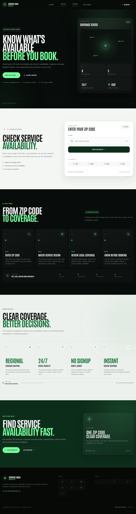

# Service Area Checker UI

A responsive React interface for checking ZIP-code service availability, regional coverage, and supported services.

## Features

- ZIP code validation with full, limited, and unavailable states
- Regional hub, response, coverage, and service details
- Active section navigation with responsive mobile menu
- Fixed header, icon-only footer links, and go-to-top control

## Tech stack

React, Vite, JavaScript, styled-components, and react-icons.

## Run locally

```bash
npm install
npm run dev
```

Build with `npm run build` and deploy with `npm run deploy`.

## Live

[Open Service Area Checker UI](https://a2rp.github.io/service-area-checker-ui/)



## Links

- [Portfolio](https://www.ashishranjan.net/)
- [GitHub](https://github.com/a2rp)
- [CodePen](https://codepen.io/ash1198)
- [LinkedIn](https://www.linkedin.com/in/aashishranjan)
- [Facebook](https://www.facebook.com/theash.ashish/)
- [YouTube](https://www.youtube.com/@ashishranjan-ashz?sub_confirmation=1)
- [Email](mailto:ash.ranjan09@gmail.com)

## Support

- [Support](https://a2rp-donation-page.netlify.app/)
- [Buy Me a Coffee](https://buymeacoffee.com/a2rp)
- [Patreon](https://patreon.com/a2rp)
